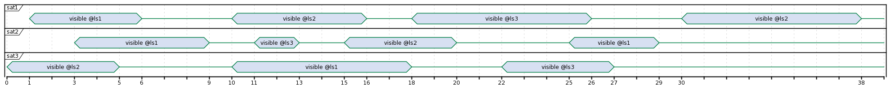
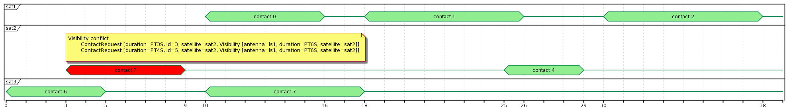
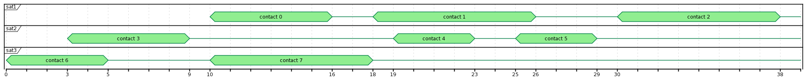

Toy problem to get the hands on [Optaplanner](https://github.com/kiegroup/optaplanner)

Inputs:
1. Satellite visibilities: a list of opportunities to contact a satellite from a ground antenna. 
Each vibility has the following attributes: time period, satellite id, antenna id
2. Contact requests: a list of requests to contact a satellite.
Each request has the following attributer: required duration, satellite id

Output:
1. Contact plan: a list of (contact request, satellite visibility)

Constraints:
1. Must not assign the same visibility to more than one contact request
1. Must not assign a visibility with a duration shorter than required by the contact request
1. Must not assign a visibility for sat X to a contact request for sat Y
1. Must not assign overlapping visibilities for a sat
1. Must not use the same antenna to stablish more than one contact at the same time

Usage:

```
mvn test
```
```
mvn exec:java
```

The execution takes the following input files:
1. `input-visibilities.csv` the available satellite visibilities with the following fields: `id`, `satellite`, `antenna`, `from`, `to`. For example
```csv
1,sat1,ls1,2000-01-01T00:00:01.00Z,2000-01-01T00:00:06.00Z
2,sat1,ls2,2000-01-01T00:00:10.00Z,2000-01-01T00:00:16.00Z
3,sat1,ls3,2000-01-01T00:00:18.00Z,2000-01-01T00:00:26.00Z
4,sat1,ls2,2000-01-01T00:00:30.00Z,2000-01-01T00:00:38.00Z
```

2. `input-contact-requests.csv` the satellite contacts to schedule with the following fields: `id`, `duration`, `satellite`. For example
```csv
73556,PT6S,sat1
b7e88,PT6S,sat1
fd6f4,PT6S,sat1
78516,PT3S,sat2
```

The execution generates two files:
1. `visibilities.pu` visibilities temporal diagram in PlantUML format.

1. `contact-plan.pu` contact plan temporal diagram in PlantUML format.

where unsolved contact request are highlighted in red. Fully solvable plans look like
